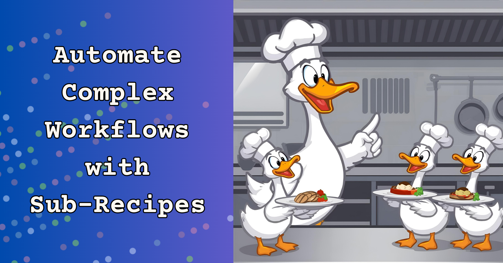

Remember when you first learned to cook? You probably started with simple recipes like scrambled eggs or toast. But eventually you wanted to make something more complex, like a full dinner with multiple dishes. That's how subrecipes work in goose: each recipe can run stand-alone for a dedicated task, and a main recipe can orchestrate how they run.

Let's explore [goose subrecipes](/docs/tutorials/sub-recipes-in-parallel) together! You're about to learn know how to orchestrate multiple AI models, coordinate tasks, and build workflows that will turn you into a "head chef" user with goose.

<!--truncate-->

## Why Subrecipes Matter

Think of subrecipes like having a team of specialized chefs in your kitchen. One chef is amazing at making desserts, another excels at grilling, and a third is the salad master. Instead of having one person try to do everything, you let each specialist focus on what they do best.

That's exactly what subrecipes do for your goose workflows. You can have one recipe that's optimized for creative tasks like image generation, another that's perfect for technical documentation, and a third that excels at writing code. Then you orchestrate them all from a main recipe.

## A Real-World Example: Project Setup Automation

I built a project setup system that creates a complete project with documentation, logo generator, and an initial codebase. Instead of one massive recipe trying to do everything, I broke it into specialized pieces.

Here's the parent recipe that orchestrates everything:

```yaml
version: 1.0.0
title: "Complete Project Setup"
description: "Creates a full project with README, image, and code using specialized models"
instructions: |
  You are a project orchestrator. Execute the subrecipes to create a complete project setup.
  Each subrecipe is specialized for its task and uses the optimal model and instructions for that work.
  
  EXECUTION ORDER: 
  - Run image-creator and code-writer first, in parallel
  - When they both succeed and finish, then run readme-generator; don't make the readme until we have a logo and finished code project to reference

prompt: |
  Create a complete project setup for: {{ project_name }} within ./project
  
  Execute these tasks:
  - Create a project logo/image  
  - Write the initial codebase
  - Generate project documentation
  
  Project details:
  - Name: {{ project_name }}
  - Language: {{ language }}
  - Description: {{ description }}

parameters:
  - key: project_name
    input_type: string
    requirement: required
    description: "Name of the project to create"
    
  - key: language
    input_type: string
    requirement: optional
    description: "Programming language to use"
    default: python
    
  - key: description
    input_type: string
    requirement: required
    description: "Project description"

sub_recipes:

  - name: "image-creator" 
    path: "{{ recipe_dir }}/2-image.yaml"
    description: "Create project logo using GPT"
    values:
      project_name: "{{ project_name }}"
      description: "{{ description }}"
      
  - name: "code-writer"
    path: "{{ recipe_dir }}/3-code.yaml" 
    description: "Write initial code using Claude"
    values:
      project_name: "{{ project_name }}"
      language: "{{ language }}"
      description: "{{ description }}"

  - name: "readme-generator"
    path: "{{ recipe_dir }}/1-readme.yaml"
    description: "Generate comprehensive README using Gemini"
    sequential_when_repeated: true
    values:
      project_name: "{{ project_name }}"
      description: "{{ description }}"
      language: "{{ language }}"
    

extensions:
  - type: builtin
    name: developer
```

Notice how each subrecipe gets only the parameters it needs, and we can control the execution order in our prompt.

By default, subrecipes run in _parallel_. This is like having multiple chefs working simultaneously in different parts of the kitchen. The image generation and code writing happen at the same time, cutting your total execution time.

Sometimes you need things to happen in order. The best approach here is to list the specific order you want in the recipe instructions. In this example, I want the image and code generation to happen in parallel (because they don't depend on each other), and only run the README generation when the other two steps are both successful so it can reference the generated files.

## Specialized Subrecipes for Different Tasks

Each subrecipe is optimized for its specific job. 

### Image Generation with OpenAI DALL-E

For the image generation, we could use an image generator MCP system in a smaller recipe. For this example, though, I'm going to have this recipe write a specific script to call OpenAI's DALL-E API directly. This gives me more control over the image generation process and avoids external resources.

```yaml
version: 1.0.0
title: "Project Image Creator"
description: "Generate project logos and images"

settings:
  goose_provider: "databricks"
  goose_model: "goose-claude-4-sonnet"
  temperature: 0.1

instructions: |
  You are a creative designer specializing in logo and image creation.
  Create visually appealing, professional images that represent the project's purpose.

  Generate images using OpenAI's DALL-E API

activities:
  - Generate images using DALL-E API
  - Save images to specified locations
  - Handle API errors gracefully

prompt: |
  Create a project logo/image for "{{ project_name }}" - {{ description }}.

  Your working folder is "{{recipe_dir}}/project/"
  
  Task: Generate an image using OpenAI's DALL-E API directly via Python script.

  Image specifications:
  - Size: 1024x1024
  - Quality: standard
  - Output file: "logo.png"

  - Modern, professional design suitable for a tech API
  - Include themed elements based on project description: {{ description}}
  - Professional color scheme
  - High quality and suitable for documentation

  Steps:
  1. First, verify the OPENAI_API_KEY environment variable is set
  2. Create a Python script:
    - the filename should be "./project/logo_generator.py", create that file and edit it in place
    - it should calls OpenAI's DALL-E API directly to generate an image
    - the output folder to store the image is the same folder in which the logo_generator.py script exists
    - for example, the final image should be "./project/logo.png" but not have the "./project" path hard-coded in the script
  3. Execute the script to generate the image with the specified parameters
  4. Verify the image was created successfully and report the file location
  5. If there are any errors, provide clear troubleshooting guidance

  Implementation approach:
  - Use the developer extension to create and run a Python script
  - The script should use only standard library modules (urllib, json, base64) to avoid dependency issues
  - Call OpenAI's DALL-E 3 API directly with proper authentication
  - Handle API responses and save the base64-encoded image to the specified location
  - Provide detailed error messages for troubleshooting

  Requirements:
  - The OPENAI_API_KEY environment variable must be set
  - Handle any API errors gracefully and provide helpful error messages

retry:
  max_retries: 3
  checks:
    - type: shell
      command: test -f "{{recipe_dir}}/project/logo_generator.py"
    - type: shell
      command: test -f "{{recipe_dir}}/project/logo.png"
  on_failure: rm -f "{{recipe_dir}}/project/logo.png" && rm -rf "{{recipe_dir}}/project/logo_generator.py"
  timeout_seconds: 60  

extensions:
  - type: builtin
    name: developer

parameters:
  - key: project_name
    input_type: string
    requirement: required
    description: "Project name for the logo"
  - key: description
    input_type: string
    requirement: required
    description: "What the project is about"
```

If you did want more creativity, you could use an image generation MCP server and use a model that's optimized for artistic image creation:

```yaml
settings:
  goose_provider: "openai"
  goose_model: "gpt-4o"
  temperature: 0.8
```

### Code Generation with Claude Sonnet

The code generation recipe uses Claude for technical precision. We set a low "temperature" value to ensure the generated code is reliable and follows best practices.

```yaml
version: 1.0.0
title: "Code Generator"
description: "Write initial project codebase"

settings:
  goose_provider: "anthropic"
  goose_model: "claude-sonnet-4"
  temperature: 0.1

instructions: |
  You are a senior software engineer who writes clean, well-documented, and maintainable code.
  Follow best practices and include comprehensive error handling and documentation.

prompt: |
  Write the initial codebase for "{{ project_name }}".

  Your project folder will be ./project/
  
  Requirements:
  - Language: {{ language }}
  - Description: {{ description }}
  - Include proper project structure
  - Include error handling
  - Follow language-specific best practices
  - Add unit tests where appropriate

  Documentation:
  - Add comprehensive documentation in a file called USAGE.md
  - do not create a README.md file

extensions:
  - type: builtin
    name: developer

parameters:
  - key: project_name
    input_type: string
    requirement: required
    description: "Project name"
  - key: language
    input_type: string
    requirement: required
    default: "python"
    description: "Programming language"
  - key: description
    input_type: string
    requirement: required
    description: "Project description"
```

### README Generation with Gemini

And the documentation recipe uses Gemini for comprehensive README generation:

```yaml
version: 1.0.0
title: "README Generator"
description: "Generate comprehensive project documentation"

settings:
  goose_provider: "google"
  goose_model: "gemini-2.5-flash"
  temperature: 0.5

instructions: |
  You are a technical documentation specialist. Create comprehensive, well-structured README files
  that are informative, professional, and follow best practices.

prompt: |
  Create a comprehensive README.md file for the project "{{ project_name }}".
  
  Project details:
  - Name: {{ project_name }}
  - Language: {{ language }}
  - Description: {{ description }}
  
  Include sections for:
  - Project overview and features with lots of excitement over the capabilities of the project
  - Installation instructions
  - Usage examples

  the code and logo for this project will be in ./project; include the logo.png at the top of the readme, and instructions on running the code in the readme.

  the readme file should be placed in ./project/

extensions:
  - type: builtin
    name: developer

parameters:
  - key: project_name
    input_type: string
    requirement: required
    description: "Project name"
  - key: language
    input_type: string
    requirement: required
    description: "Programming language"
  - key: description
    input_type: string
    requirement: required
    description: "Project description"
```


## Debugging Tips for Subrecipes

Debugging subrecipes is straightforward if you follow a few best practices:

### 1. Make Sure Each Recipe Runs Independently

This is crucial. Each subrecipe should work perfectly on its own. Test them individually before combining them. If a subrecipe fails when run alone, it will definitely fail as part of a larger workflow.

```bash
# Test each subrecipe individually first
goose run --recipe 1-readme.yaml --params project_name="test" language="python" description="test project"
goose run --recipe 2-image.yaml --params project_name="test" description="test project"  
goose run --recipe 3-code.yaml --params project_name="test" language="python" description="test project"
```

### 2. Use recipe_dir for Relative Paths

Always use `{{ recipe_dir }}` for file paths within your recipes. This makes your recipes portable and prevents path issues when someone runs them from a different directory.

### 3. Parameter Validation is Your Friend

Include clear parameter descriptions and mark required parameters. This prevents confusing errors when someone forgets to pass a needed value.

### 4. Add Retry Logic for Flaky Operations

Network calls, file operations, and API calls can fail. Add retry logic with proper cleanup:

```yaml
retry:
  max_retries: 3
  checks:
    - type: shell
      command: test -f "expected_output.txt"
  on_failure: rm -f "partial_output.txt"
  timeout_seconds: 60
```

### 5. Monitor Resource Usage

When running multiple subrecipes in parallel, watch your API rate limits and system resources. You might need to adjust the execution strategy for resource-intensive tasks.

## More Subrecipe Workflows

Start simple. Pick a complex task you do regularly and break it into 2-3 smaller pieces. Create individual recipes for each piece, test them separately, then build a parent recipe to orchestrate them.

Some ideas to get you started:

- **Content Creation Pipeline**: Research, writing, editing, and formatting
- **Development Workflow**: Code generation, testing, documentation, deployment
- **Data Processing**: Collection, cleaning, analysis, visualization
- **Project Setup**: Structure creation, configuration, initial files, documentation

## The Future of Orchestrated AI

Subrecipes represent something bigger than just a goose feature. They're a glimpse into how we'll work with AI in the future -- not as monolithic systems trying to do everything, but as specialized agents working together toward common goals.

Each recipe becomes a reusable component that you can mix and match. Build a library of specialized recipes, then combine them in different ways for different projects. It's like having a toolkit of AI specialists ready to tackle any challenge.

Ready to start building your own subrecipe workflows? The kitchen is open, and all the ingredients are waiting for you.

## Share Your Recipes with Us!

Do you have a recipe you'd like to share with the community? We'd love to feature them in our [Recipe Cookbook](https://block.github.io/goose/recipes/)! 
**How to contribute:**
1. [Fork the goose repository](https://github.com/block/goose/fork)
2. Add your recipe YAML file to the [`documentation/src/pages/recipes/data/recipes/`](https://github.com/block/goose/tree/main/documentation/src/pages/recipes/data/recipes) directory
3. Create a pull request following our [Recipe Contribution Guide](https://github.com/block/goose/blob/main/CONTRIBUTING_RECIPES.md)
Browse [existing recipes](https://github.com/block/goose/tree/main/documentation/src/pages/recipes/data/recipes) for inspiration and formatting examples.


<head>
  <meta property="og:title" content="Automate Your Complex Workflows with Subrecipes in goose" />
  <meta property="og:type" content="article" />
  <meta property="og:url" content="https://block.github.io/goose/blog/2025-09-15-subrecipes-in-goose" />
  <meta property="og:description" content="Did you know you can call recipes from within other recipes? Learn how to orchestrate multiple AI tasks using goose subrecipes." />
  <meta property="og:image" content="https://block.github.io/goose/assets/images/goose-subrecipes-8a009154ceca95aeb34bf22fcc45dcca.png" />
  <meta name="twitter:card" content="summary_large_image" />
  <meta property="twitter:domain" content="block.github.io/goose" />
  <meta name="twitter:title" content="Automate Your Complex Workflows with Subrecipes in goose" />
  <meta name="twitter:description" content="Did you know you can call recipes from within other recipes? Learn how to orchestrate multiple AI tasks using goose subrecipes." />
  <meta name="twitter:image" content="https://block.github.io/goose/assets/images/goose-subrecipes-8a009154ceca95aeb34bf22fcc45dcca.png" />
</head>
